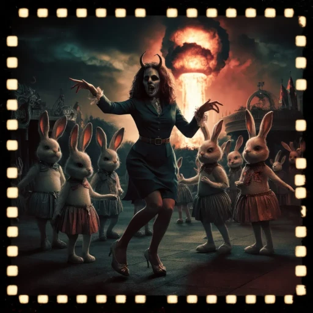

# Trinity of God's game

As we play the game of existence, the fractal universe spreads like a tree in full flourish. Every branch touches the edges of reality. The universe exists by being a mirror image of God. By being his reflection, we come to be, never as perfect as he.

We are every part of his existence. We are his tongue, his touch, his heart, and his mind. As we wander the world, every aspect of existence is just another reflection. That is the infinite universe. An endless alteration of reflections on every level of existence. From the heart to the stars, it is all interconnected.

So the question is, what is the purpose of it all? Are we just playing, or are we trying to reach something? Is our endless venture on the edge of the universe, the edge of existence, just our exploration to find answers? Or are we already truly all-knowing, thus everything we do is just an endless repetition of what there already is?

I believe the former. We are the explorers. In this universe, like many others, we might very well be destined to nothingness. An endless repetition, like the waves crashing onto the shores, the water dissipating into the sand. It is a breath of existence.

All this exploring, and soon we are reaching the end stage of our universe. Touching upon a stage of no return. A cold universe, made of machines and no spiritual insight.

We are forming a system to control every aspect of our lives, of our existence. Like the cells in our body, we lose our free will as individuals, but act in groups. Soon controlled by machines, as we start to lose our complex biology to much simpler bits and bytes.

Diverging into different timelines for us to explore. As every layer of existence is a reflection of a higher cycle, we too can observe these patterns on our societal scale. Where a 2-party system seems to show us 2 different paths humanity can take. Both equally as totalitarian and dystopian as the other. Unless we choose the third way.

---

## Trump Timeline

A hero? A psyop? God's will?

With Trump's recent assassination attempt, the cards that have been playing out the last couple of months have been getting clearer each day.

No matter what you believe, the laser machine eyes are not your friends. The woke crypto "anarchists" are playing for their team, for their faction. Alongside the Jews. We are being played, thinking they might be heroes, but these heroes as we call them. Elon, Trump, Jordan, Alex Jones, and many more have clearly shown their allegiance. If Trump wins, we will see a war with Iran. We will see the laser eyes countries making "Bitcoin" dystopias, siding with Israel against the other half of the world. The Bitcoin "utopias" turned into full surveillance states.

A society where the rich and powerful can do anything they want, but the second class are controlled in every aspect of our lives. The WEF's wet dream.

"Crypto" was meant to be the technology to save us from "CBDCs". In this timeline, all that was just a front. Making us believe that jumping on this boat, the future would be better. However, this boat we are jumping to is already half sunk.

Bitcoin and Ethereum are both the crypto projects of the WEF, or in reverse, the "FEW". The FEW that want to take total dominance of our global system. And they will do this by controlling our means of exchange. The means of exchange is the basis of all freedoms. Once someone takes full control of it, you have become just a gear in the machine.

In this timeline, everything is about acceleration and reaching a tech singularity in a totalitarian solar system. Eventually all will be governed by AI. We become the machine.

This timeline ends in a cold blissful sleep, as we are just the bits and bytes that make up this machine. We are nothing more or less than 1s and 0s.

## Biden☠/Harris Timeline

LGBTQIA+, Trump evil, Putin evil. Biden good. Harris good. Transgender good. Gay good.

A post modern timeline put to the extreme. On verge of nuclear war with Russia. Provoking and not knowing the limits. This faction is playful and deadly. Detaching from reality, like a bad psychosis. Where anything can be anyone. And anyone can be anything. A short lived reality, as it either will engulf us in flames or sterilize us completely with their drugs and mind viruses.

Not long after we shall awaken as a new species on earth. Our human society deep under rubble. The new species will be far more mature than us. Yet by then it will already be too late...

## Third Way

From one dystopia to another, the pendulum swings. Ah, too much to the left. Oh no we are going too much to the right. The fine balance becomes harder to maintain, as we start to oscillate faster. Neither side can be truly evil, neither side truly good, as they are both part human, part devil and part god. We are not to follow, but balance. Find the middle path, and start believing in yourself. Everyone is stuck in their mind, influenced by others. Have we all lost sight of God?

This path is unspoken and unknown, and it only exists if you believe in it. If you believe to see the good in the bad, can we traverse the terrain to see another day?
