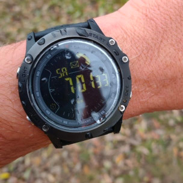

# Life RPG
Growing up stuck in the matrix, getting sucked into technology. Losing the true path as we become alienated and detached from the real world.

Like many of us, I am no stranger to these experiences.

---

I find it vital to understand that we can modify our brains, change how we think and act. We are not taught these things. So we must find out for ourselves.

One of such techniques I have found useful in periods of my life, especially during difficult times. Is to "gamify" my life. So far I have successfully utilized the game 3 times in my life.
- While living rural in Portugal
- During the plandemic in Germany
- And while traveling in ASEAN.

The game is simple, and I have used physical paper and pen to make this game playable.

I design a token, for example my waozi token.

I sign each and every token I "print", by scribling on a piece of paper and cutting it up into little squares I add to my "bank".

> cutting up my woazi tokens

In this case, my bank is a simple plastic shot glass.

I then design quests I can do to gain these tokens.

I usually come up with a few dailies. Such as swim in the cold lake. Do the wim hof breathing technique and do 10 push ups.

> I would usually swim between 5-10 min in the icey lake shown in the cover photo

After finishing a quest I would receive a fair amount of tokens. I add the tokens to my wallet manually and then I can enjoy my own little shop.

> Stainless steel pipe to smoke hash or weed

One of these items I would indulge myself with my tokens is smoking my pipe. With this strategy I managed to keep building my routine and keep my consumption balanced.

At other times when I was not consuming I would reward myself with playtime or watch time. Paying tokens to watch an episode or play a videogame for an hour.

> Life RPG setup in my Caravan while staying in Portugal

The beauty about this game is that you can make it as simple or as complex as you want. And constantly calibrate with your current possibilities.

 
> My "life" box, each day separated into a new section in a box

During the plandemic, I ended up extending the LIFE RPG game into an entire Life Box, where i would split each day into separate chakras and focus on the energy of that day. The game is meant to be fun.

Once you learn to make routines in your life, you know you can do it and you can start again even when you stop for a longer period.

The hardest is to get into a routine in the first place. There are many strategies to get into a routine, and you should experiment and find out what works best for you.